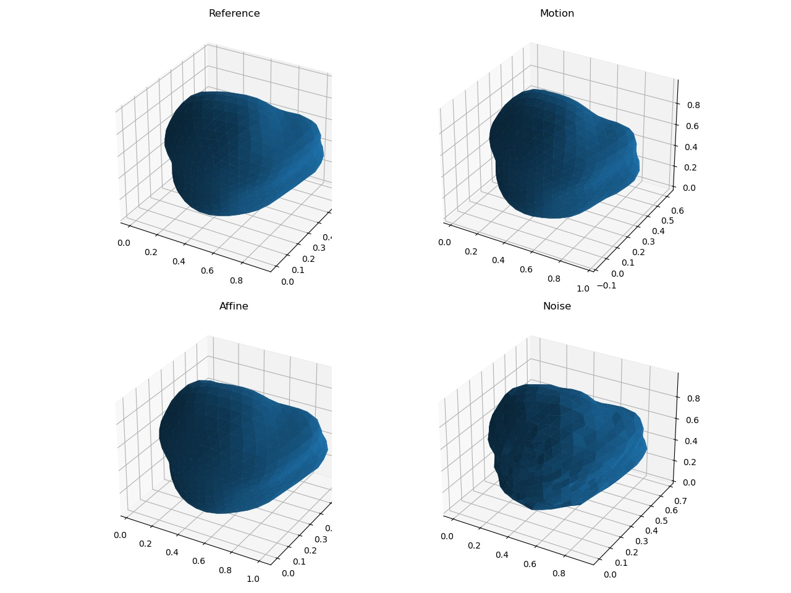

# Intraoperative Motion Classification

This tutorial is adapted from [Point cloud classification with PointNet](https://keras.io/examples/vision/pointnet/) with TensorFlow and Keras.

Here, we use Intraoperative motion data from an ultrasound-guided prostate intervention, for a motion detection problem. The clinical background can be found in the [MPHY0030 SSM tutorial](https://github.com/YipengHu/MPHY0030/tree/main/tutorials/statistical_motion_model/python).

First download the simulated motion data by running the script in the [mphy0043 conda env](../../docs/dev_tools.md): 
```bash
conda activate mphy0043
python download_data.py
```
The run the motion classification script:
```bash
python motion_classification.py
```



