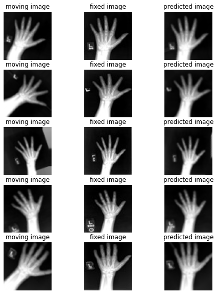

# Image Registration

This is a tutorial adapted from MONAI [2D affine image registration](https://github.com/Project-MONAI/tutorials/blob/master/2d_registration/registration_mednist.ipynb), described as one of first [MONAI registration demos](https://medium.com/pytorch/monai-starts-to-explore-learning-based-medical-image-registration-ab6b143840b7).

The 2D affine image registration tutorial illustrates a workflow of estimating affine transformation parameters between a pair of moving and fixed 2D images. To keep it lightweight and focus on demonstrating the core concepts, the “X-Ray hands” images from the MedNIST dataset are sampled before being randomly transformed to form the moving and fixed image pairs for training and testing.

In this workflow, pairs of gray-scale, intensity-normalised images are stacked at the channel dimension as the input to a GlobalNet. The GlobalNet then learns to estimate affine transformation parameters by optimising the mean square errors between the fixed image and the warped moving image — a case of unsupervised learning for affine registration.

In real-world applications, similar affine registration workflows have been widely used to estimate an initial global alignment efficiently. The initial registration step is then followed by or combined with a more refined, local, and non-rigid registration, such as those estimating DDFs or DVFs.


Start the tutorial within the [mphy0043-pt env](../../docs/dev_tools.md):
```bash
micromamba activate mphy0043-pt
jupyter notebook
```
Then, select the `registration_mednist.ipynb` notebook file.




>Further exploring software for medical image registration with deep learning at [DeepReg](https://github.com/DeepRegNet/DeepReg).  
