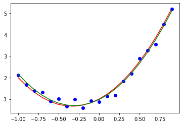

# Surgical Data Regression

This tutorial contains four Jupyter Notebook
- Linear curve fitting (Python) <[Notebook][part1_notebook]> <[Colab][part1_colab]>
- Cross validation (Python) <[Notebook][part2_notebook]> <[Colab][part2_colab]>
- Linear curve fitting (TensorFlow) <[Notebook][part3_notebook]> <[Colab][part3_colab]>
- Logistic data regression (PyTorch) <[Notebook][part4_notebook]> <[Colab][part4_colab]>

All the tutorials run directly on Google Colab (by clicking the links above). Get started with [Runtime] -> [Run all]. Alternatively, download the ipynb files, then upload them to [Colab](https://colab.research.google.com). 

Running these on Jupyter notebook requires a number of dependencies to be installed locally, including numpy, matplotlib and TensorFlow/PyTorch. The [mphy0043-tf / mphy0043-pt env](../../docs/dev_tools.md) may be used for this tutorial.  

Performance varies.

[part1_notebook]: https://github.com/YipengHu/MPHY0043/blob/master/tutorials/regression/01-CurveFitting.ipynb
[part1_colab]: https://colab.research.google.com/github/YipengHu/MPHY0043/blob/master/tutorials/regression/01-CurveFitting.ipynb

[part2_notebook]: https://github.com/YipengHu/MPHY0043/blob/master/tutorials/regression/02-CrossValidation.ipynb
[part2_colab]: https://colab.research.google.com/github/YipengHu/MPHY0043/blob/master/tutorials/regression/02-CrossValidation.ipynb

[part3_notebook]: https://github.com/YipengHu/MPHY0043/blob/master/tutorials/regression/03-CurveFitting-TensorFlow.ipynb
[part3_colab]: https://colab.research.google.com/github/YipengHu/MPHY0043/blob/master/tutorials/regression/03-CurveFitting-TensorFlow.ipynb

[part4_notebook]: https://github.com/YipengHu/MPHY0043/blob/master/tutorials/regression/04-LogisticRegression-PyTorch.ipynb
[part4_colab]: https://colab.research.google.com/github/YipengHu/MPHY0043/blob/master/tutorials/regression/04-LogisticRegression-PyTorch.ipynb
